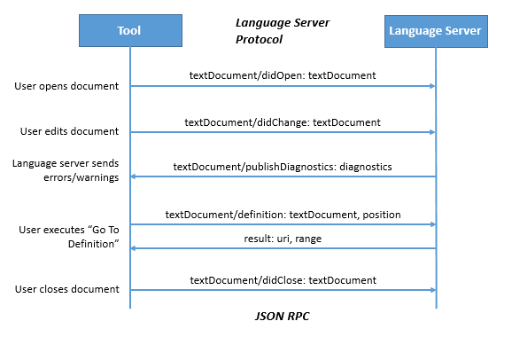

# Language Server Protocol

> **Note:** A blog covering the background and mechanics of the protocol has been added to the [Visual Studio Code](https://code.visualstudio.com/blogs/2016/06/27/common-language-protocol) site.

The Language Server protocol is used between a tool (the client) and a language smartness provider (the server) to integrate features 
like auto complete, goto definition, find all references and alike into the tool. The following diagram illustrates the communication between a tool and the language server.

The language server maintains semantic information about a program implemented in a particular language. 
* When the user opens a document in the tool, it notifies the language server that the document was opened and that the truth of the document is now maintained by the tool in a memory buffer. 
* When the user edits the document, the server is notified of the changes and updates the program's semantic information.
* As the user makes changes the language server analyses the document and notifies the tool with any errors and warnings (diagnostics) that it finds.
* When the user requests to go to the definition of a symbol, the client sends a `definition` request to the server. The server responds with the URI of the document and a range inside that document. Based on this information the tool opens the corresponding document at the position where the symbol is defined.
* When the user closes the document, a `didClose` notification is sent, informing the language server that the truth of the file is now on the file system.

The communication between the Editor/IDE host and the Language Server uses [JSON RPC v2.0](http://www.jsonrpc.org/specification). The protocol supports servers with different capabilities. The first request sent from the Editor/IDE to the language server informs the server about the supported language features.

The first version of the protocol is based on experiences we gained while
integrating [OmniSharp](http://www.omnisharp.net/) and the [TypeScript Server](https://github.com/Microsoft/TypeScript/tree/master/src/server) into 
[VS Code](https://code.visualstudio.com/). See the [history](https://github.com/Microsoft/language-server-protocol/wiki/Protocol-History) section for a brief history on how the protocol evolved.

## Contributing
If you are interested in fixing issues like typos you can either file an issue or provide a pull request containing the changes to the `protocol.md` file. 

When proposing an extension to the specification, then please refer to the [How to Contribute to the Language Server Protocol](contributing.md) document.

This project has adopted the [Microsoft Open Source Code of Conduct](https://opensource.microsoft.com/codeofconduct/). For more information see the [Code of Conduct FAQ](https://opensource.microsoft.com/codeofconduct/faq/) or contact [opencode@microsoft.com](mailto:opencode@microsoft.com) with any additional questions or comments.

## The Language Server Protocol

The file [protocol.md](protocol.md) specifies the language server protocol.

## License
[Creative Commons Attribution / MIT](License.txt)
