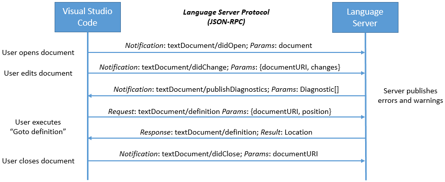
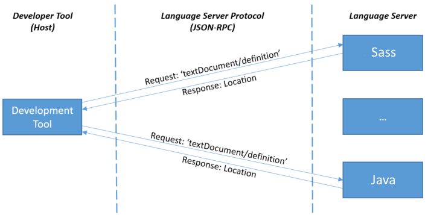

A language server runs in its own process and tools like VS Code communicate with the server using the language protocol over JSON-RPC. Another nice side effect of the language server operating in a dedicated process is that performance issues related to a single process model are avoided. The actual transport channel can either be `stdio`, `sockets`, `named pipes`, or `node ipc` if both the client and server are written in Node.js.

Below is an example for how a tool and a language server communicate during a routine editing session:



* **The user opens a file (referred to as a *document*) in the tool**: The tool notifies the language server that a document is open ('textDocument/didOpen'). From now on, the truth about the contents of the document is no longer on the file system but kept by the tool in memory.

* **The user makes edits**: The tool notifies the server about the document change ('textDocument/didChange') and the semantic information of the program is updated by the language server. As this happens, the language server analyses this information and notifies the tool with the detected errors and warnings ('textDocument/publishDiagnostics').

* **The user executes "Go to Definition" on a symbol in the editor**: The tool sends a 'textDocument/definition' request with two parameters: (1) the document URI and (2) the text position from where the Go to Definition request was initiated to the server. The server responds with the document URI and the position of the symbol's definition inside the document.

* **The user closes the document (file)**: A 'textDocument/didClose' notification is sent from the tool, informing the language server that the document is now no longer in memory and that the current contents is now up to date on the file system.

This example illustrates how the protocol communicates with the language server at the level of editor features like "Go to Definition", "Find all References". The data types used by the protocol are editor or IDE 'data types' like the currently open text document and the position of the cursor. The data types are not at the level of a programming language domain model which would usually provide abstract syntax trees and compiler symbols (for example, resolved types, namespaces, ...). This simplifies the protocol significantly.

Now let's look at the 'textDocument/definition' request in more detail. Below are the payloads that go between the client tool and the language server for the "Go to Definition" request in a C++ document.

This is the request:

```json
{
    "jsonrpc": "2.0",
    "id" : 1,
    "method": "textDocument/definition",
    "params": {
        "textDocument": {
            "uri": "file:///p%3A/mseng/VSCode/Playgrounds/cpp/use.cpp"
        },
        "position": {
            "line": 3,
            "character": 12
        }
    }
}
```

This is the response:

```json
{
    "jsonrpc": "2.0",
    "id": "1",
    "result": {
        "uri": "file:///p%3A/mseng/VSCode/Playgrounds/cpp/provide.cpp",
        "range": {
            "start": {
                "line": 0,
                "character": 4
            },
            "end": {
                "line": 0,
                "character": 11
            }
        }
    }
}
```

In retrospect, describing the data types at the level of the editor rather than at the level of the programming language model is one of the reasons for the success of the language server protocol. It is much simpler to standardize a text document URI or a cursor position compared with standardizing an abstract syntax tree and compiler symbols across different programming languages.

When a user is working with different languages, VS Code typically starts a language server for each programming language. The example below shows a session where the user works on Java and SASS files.



We quickly learned that not every language server can support all features defined by the protocol. We therefore introduced the concept of 'capabilities'. With capabilities, the client and server announces their supported feature set. As an example, a server announces that it can handle the 'textDocument/definition' request, but it might not handle the 'workspace/symbol' request. Similarly, clients can announce that they are able to provide 'about to save' notifications before a document is saved, so that a server can compute textual edits to automatically format the edited document.

The actual integration of a language server into a particular tool is not defined by the language server protocol and is left to the tool implementors. Some tools integrate language servers generically by having an extension that can start and talk to any kind of language server. Others, like VS Code, create a custom extension per language server, so that an extension is still able to provide some custom language features.

To simplify the implementation of language servers and clients, there are libraries or SDKs for the client and server parts. These libraries are provided for different languages. For example, we maintain a [language client npm module](https://www.npmjs.com/package/vscode-languageclient) to ease the integration of a language server into a VS Code extension and another [language server npm module](https://www.npmjs.com/package/vscode-languageserver) to write a language server using Node.js. This is the current [list](https://github.com/Microsoft/language-server-protocol/wiki/Protocol-Implementations#sdks) of support libraries.