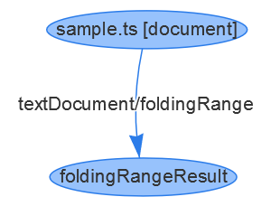
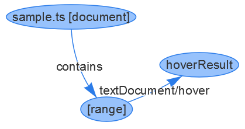
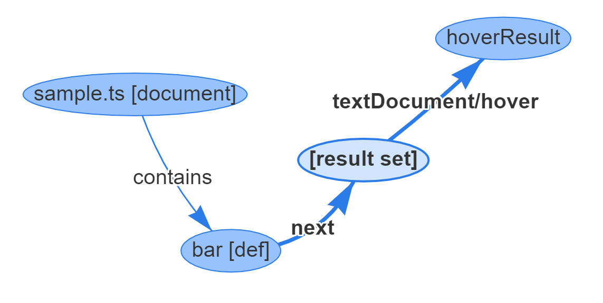
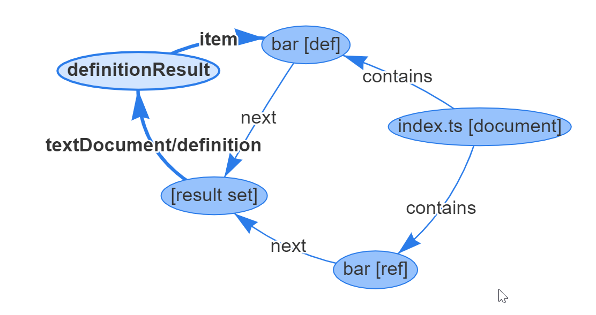
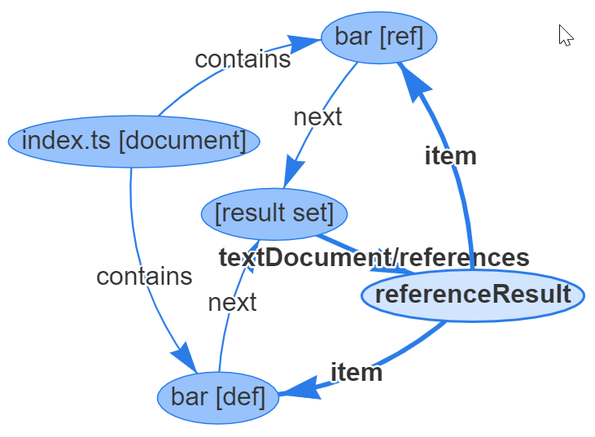

## Language Server Index Format

The purpose of the Language Server Index Format (LSIF) is it to define a standard format for language servers or other programming tools to dump their knowledge about a workspace. This dump can later be used to answer language server [LSP](https://microsoft.github.io/language-server-protocol/) requests for the same workspace without running the language server itself. Since much of the information would be invalidated by a change to the workspace, the dumped information typically excludes requests used when mutating a document. So, for example, the result of a code complete request is typically not part of such a dump.

### Changelog

#### Version 0.2.2

- Removed export and import result and replaced it with monikers linked to the definition / declaration ranges.
- Added a package information vertex to be linked to monikers that are provided through a package.
- Make results in `DefinitionResult`, `DeclarationResult` and `TypeDefinitionResult` and array only.
- Make results in `DefinitionResult`, `DeclarationResult` and `TypeDefinitionResult` optional so that they can be filled using an item edge.

### Motivation

Principal design goals:

- The format should not imply the use of a certain persistence technology.
- The data defined should be modeled as closely as possible to the [Language Server Protocol](https://microsoft.github.io/language-server-protocol/) to make it possible to serve the data through the LSP without further transformation.
- The data stored is result data usually returned from a LSP request. The dump doesn't contain any program symbol information nor does the LSIF define any symbol semantics (e.g. where a symbol is defined or referenced or when a method overrides another method). The LSIF therefore doesn't define a symbol database. Please note that this is consistent with the LSP itself which doesn't define any symbol semantics either.
- The output format will be based on JSON as with the LSP.

LSP requests that are good candidates to be supported in LSIF are:

- [`textDocument/documentSymbol`](https://microsoft.github.io/language-server-protocol/specification#textDocument_documentSymbol)
- [`textDocument/foldingRange`](https://microsoft.github.io/language-server-protocol/specification#textDocument_foldingRange)
- [`textDocument/documentLink`](https://microsoft.github.io/language-server-protocol/specification#textDocument_documentLink)
- [`textDocument/definition`](https://microsoft.github.io/language-server-protocol/specification#textDocument_definition)
- [`textDocument/declaration`](https://microsoft.github.io/language-server-protocol/specification#textDocument_declaration)
- [`textDocument/typeDefinition`](https://microsoft.github.io/language-server-protocol/specification#textDocument_typeDefinition)
- [`textDocument/hover`](https://microsoft.github.io/language-server-protocol/specification#textDocument_hover)
- [`textDocument/references`](https://microsoft.github.io/language-server-protocol/specification#textDocument_references)
- [`textDocument/implementation`](https://microsoft.github.io/language-server-protocol/specification#textDocument_implementation)

The corresponding LSP requests have one of the following two forms:

```typescript
request(uri, method) -> result
request(uri, position, method) -> result
```

where method is the JSON-RPC request method.

Concrete examples are

```typescript
request('file:///Users/dirkb/sample/test.ts', 'textDocument/foldingRange') -> FoldingRange[];
request('file:///Users/dirkb/sample/test.ts', { line: 10, character: 17 }, 'textDocument/hover') -> Hover;
```

The input tuple to a request is either `[uri, method]` or `[uri, position, method]` and the output is some form of result. For the same `uri` and `[uri, position]` tuple, there are many different requests to execute.

The dump format therefore should support the following features:

- Input data must be easily queryable (e.g. the document and the position).
- Each element has a unique id (which may be a string or a number).
- It should be possible to emit data as soon as it is available to allow streaming rather than large memory requirements. For example, emitting data based on document syntax should be done for each file as parsing progresses.
- It should be easy to add additional requests later on.

We came to the conclusion that the most flexible way to emit this is a graph, where edges represent the method and vertices are `[uri]`, `[uri, position]` or a request result. This data could then be stored as JSON or read into a database that can represent these vertices and relationships.

Assume there is a file `/Users/dirkb/sample.ts` and we want to store the folding range information with it then the indexer emits two vertices: one representing the document with its URI `file:///Users/dirkb/sample.ts`, the other representing the folding result. In addition, an edge would be emitted representing the `textDocument/foldingRange` request.

```typescript
{ id: 1, type: "vertex", label: "document", uri: "file:///Users/dirkb/sample.ts", languageId: "typescript" }
{ id: 2, type: "vertex", label: "foldingRangeResult", result: [ { ... }, { ... }, ... ] }
{ id: 3, type: "edge", label: "textDocument/foldingRange", outV: 1, inV: 2 }
```

The corresponding graph looks like this



### Ranges

For requests that take a position as its input, we need to store the position as well. Usually LSP requests return the same result for positions that point to the same word / name in a document. Take the following TypeScript example:

```typescript
function bar() {
}
```

A hover request for a position denoting the `b` in `bar` will return the same result as a position denoting the `a` or `r`. To make the dump more compact, it will use ranges to capture this instead of single positions. The following vertices will be emitted in this case. Note that line, character are zero based as in the LSP:

```typescript
{ id: 4, type: "vertex", label: "range", start: { line: 0, character: 9}, end: { line: 0, character: 12 } }
```

To bind the range to a document, we use a special edge labeled `contains` which points from a document to a range.

```typescript
{ id: 5, type: "edge", label: "contains", outV: 1, inV: 4}
```

To bind the hover result to the range, we use the same pattern as we used for the folding ranges. We emit a vertex representing the hover result and an edge representing the `textDocument/hover` request.

```typescript
{
  id: 6,
  type: "vertex",
  label: "hoverResult",
  result: {
    contents: [
      { language: "typescript", value: "function bar(): void" }
    ]
  }
}
{ id: 7, type: "edge", label: "textDocument/hover", outV: 4, inV: 6 }
```

The corresponding graph looks like this



The ranges emitted for a document must follow these rules:

1. No two ranges can be equal.
1. No two ranges can overlap, claiming the same position in a document unless one range is entirely contained by the other.

If a position in a document is mapped to a range and more than one range covers the position, the following algorithm should be used:

1. sort the ranges by containment with innermost first
1. for range in ranges do
   1. check if the range has an outgoing edge `textDocument/${method}`
   1. if yes, use it
1. end
1. return `null`

### Result Set

Usually the hover result is the same whether you hover over a definition of a function or over a reference of that function. The same is actually true for many LSP requests like `textDocument/definition`, `textDocument/references` or `textDocument/typeDefinition`. In a naïve model, each range would have outgoing edges for all these LSP requests and would point to the corresponding results. To optimize this and to make the graph easier to understand, the concept of a `ResultSet` is introduced. A result set acts as a hub to be able to store information common to a lot of ranges. The `ResultSet` itself doesn't carry any information. So it looks like this:

```typescript
export interface ResultSet {
}
```

The corresponding output of the above example with a hover using a result set looks like this:

```typescript
{ id: 1, type: "vertex", label: "document", uri: "file:///Users/dirkb/sample.ts", languageId: "typescript" }
{ id: 2, type: "vertex", label: "resultSet" }
{ id: 3, type: "vertex", label: "range", start: { line: 0, character: 9}, end: { line: 0, character: 12 } }
{ id: 4, type: "edge", label: "contains", outV: 1, inV: 3 }
{ id: 5, type: "edge", label: "refersTo", outV: 3, inV: 2 }
{ id: 6, type: "vertex", label: "hoverResult", result: {"contents":[{"language":"typescript","value":"function bar(): void"},""] }
{ id: 7, type: "edge", label: "textDocument/hover", outV: 2, inV: 6 }
```



The pattern of storing the result with the `ResultSet` will be used for other requests as well. The lookup algorithm is therefore as follows for a request [document, position, method]:

1. find all ranges for [document, position]. If none exist, return `null` as the result
1. sort the ranges by containment the innermost first
1. for range in ranges do
   1. check if range has an outgoing edge `textDocument/${method}`. if yes, use it and return the corresponding result
   1. check if range has an outgoing edge `refersTo`. if yes, resolve the result set
   1. check if the result set has an outgoing edge `textDocument/${method}`. if yes, use it and return the corresponding result
1. end
1. otherwise return `null`

### Request: `textDocument/definition`

The same pattern of connecting a range, result set, or a document with a request edge to a method result is used for other requests as well. Let's next look at the `textDocument/definition` request using the following TypeScript sample:

```typescript
function bar() {
}

function foo() {
  bar();
}
```

This will emit the following vertices and edges to model the `textDocument/definition` request:

```typescript
// The bar declaration
{ id: 4, type: "vertex", label: "resultSet" }
{ id: 7, type: "vertex", label: "range", start: { line: 0, character: 9 }, end: { line: 0, character: 12 } }

// The definition result linked to the bar result set
{ id: 13, type: "vertex", label: "definitionResult", result: [7] }
{ id: 14, type: "edge", label: "textDocument/definition", outV: 4, inV: 13 }

// The bar reference
{ id: 26, type: "vertex", label: "range", start: { line: 4, character: 2 }, end: { line: 4, character: 5 } }
// The bar range pointing to the bar result set
{ id: 28, type: "edge", label: "refersTo", outV: 26, inV: 4}
```



In the example above, the definition result has only one value: the id `7`. We could have instead emitted an edge directly pointing from id `4` to id `7`. However, we introduced the definition result vertex for two reasons:

- To have consistency with all other requests that point to a result.
- The result is actually an array to support languages that have type merging. The LSP result for the `textDocument/definition` request is defined as `Location | Location[]` but for easier handling the LSIF only supports arrays.

Consider the following TypeScript example:

```typescript
interface X {
  foo();
}
interface X {
  bar();
}
let x: X;
```

Running **Go to Definition** on `X` in `let x: X` will show a dialog which lets the user select between the two definitions of the `interface X`. The emitted JSON in this case looks like this:

```typescript
{ id: 31, type: "vertex", label: "definitionResult", result: [5, 10] }
```

The TypeScript interface for a definition result looks like this:

```typescript
/**
 * A vertex representing a definition result.
 */
export interface DefinitionResult {
  /**
   * The label property.
   */
  label: 'definitionResult';

  /**
   * The actual result.
   */
  result?: (RangeId | lsp.Location)[];
}
```

Optionally results can be emitted lazily, by ommiting `result` field and adding results later with an `item` edge (without `property`).

### Request: `textDocument/declaration`

There are programming languages that have the concept of declarations and definitions (like C/C++). If this is the case, the dump can contain a corresponding `declarationResult` vertex and a `textDocument/declaration` edge to store the information. They are handled analogously to the entities emitted for the `textDocument/definition` request.

### More about Request: `textDocument/hover`

In the LSP, the hover is defined as follows:

```typescript
export interface Hover {
  /**
   * The hover's content
   */
  contents: MarkupContent | MarkedString | MarkedString[];

  /**
   * An optional range
   */
  range?: Range;
}
```

where the optional range is the name range of the word hovered over.

> **Side Note**: This is a pattern used for other LSP requests as well, where the result contains the word range of the word the position parameter pointed to.

This makes the hover different for every location so we can't really store it with the result set. But wait, the range is the range of one of the `bar` references we already emitted and used to start to compute the result. To make the hover still reusable, we ask the index server to fill in the starting range if no range is defined in the result. So for a hover request executed on range `{ line: 4, character: 2 }, end: { line: 4, character: 5 }` the hover result will be:

```typescript
{ id: 6, type: "vertex", label: "hoverResult", result: { contents: [ { language: "typescript", value: "function bar(): void" } ], range: { line: 4, character: 2 }, end: { line: 4, character: 5 } } }
```

### Request: `textDocument/references`

Storing references will be done in the same way as storing a hover or Go to Definition ranges. It uses a reference result vertex. In a naïve approach, the reference result would contain range ids as well. However, that would force the emitter of the reference result to buffer the result until all files are parsed to ensure all references are contained. This usually leads to high memory consumption so we added a way to add values into a result vertex dynamically. This is done as follows:

- The result is emitted empty.
- An item is added to the result by emitting an `item` edge which points from the result to the item.

Look at the following example:

```typescript
function bar() {
}

function foo() {
  bar();
}
```

The relevant JSON output looks like this:

```typescript
// The bar declaration
{ id: 4, type: "vertex", label: "resultSet" }

// The reference result
{ id: 5, type: "vertex", label: "referenceResult"}
// Link it to the result set
{ id: 6, type: "edge", label: "textDocument/references", outV: 4, inV: 5 }

// The range defining bar
{ id: 7, type: "vertex", label: "range", start: { line: 0, character: 9 }, end: { line: 0, character: 12 } }
// Link the range to the result set
{ id: 9, type: "edge", label: "refersTo", outV: 7, inV: 4 }
// Add the range to the reference result
{ id: 10, type: "edge", label: "item", property: "definition", outV: 5, inV: 7 }

// The range referencing bar
{ id: 26, type: "vertex", label: "range", start: { line: 4, character: 2 }, end: { line: 4, character: 5 } }
// Link it to the result set
{ id: 28, type: "edge", label: "refersTo", outV: 26, inV: 4 }
// Add it to the reference result.
{ id: 29, type: "edge", label: "item", property: "reference", outV: 5, inV: 26 }
```



We tag the `item` edge with id 10 as a definition since the reference result distinguishes between definitions, declarations, and references. This is done since the `textDocument/references` request takes an additional input parameter `includeDeclarations` controlling whether declarations and definitions are included in the result as well. Having three distinct properties allows the server to compute the result accordingly. The `ReferenceResult` could be declared as follows:

```typescript
export interface Draft_ReferenceResult { // See below

  label: 'referenceResult';

  declarations?: (RangeId | lsp.Location)[];

  definitions?: (RangeId | lsp.Location)[];

  references?: (RangeId | lsp.Location)[];
}
```

The reference result also allows inlining the result as an ID within the array. This should be used if the result vertex can easily be computed (for example, for local variable, private members, not exported members, ...) to make the output more compact. It also allows inlining a `lsp.Location` directly. This can be used if a range needs to be stored that conflicts with the rule that ranges must not overlap.

The concept of a reference result is also useful when computing references to methods overridden in a type hierarchy.

Take the following example:

```typescript
interface I {
  foo(): void;
}

class A implements I {
  foo(): void {
  }
}

class B implements I {
  foo(): void {
  }
}

let i: I;
i.foo();

let b: B;
b.foo();
```

The reference result for the method `foo` in TypeScript contains all three declarations and both references. While parsing the document, one reference result is created and then shared between all result sets.

The output looks like this:

```typescript
// The declaration of I#foo
{ id: 15, type: "vertex", label: "resultSet" }
// The shared reference result
{ id: 16, type: "vertex", label: "referenceResult" }
{ id: 17, type: "edge", label: "textDocument/references", outV: 15, inV: 16 }
{ id: 18, type: "vertex", label: "range", start: { line: 1, character: 2 }, end: { line: 1, character: 5 } }
{ id: 20, type: "edge", label: "refersTo", outV: 18, inV: 15 }
{ id: 21, type: "edge", label: "item", property: "definition", outV: 16, inV: 18 }

// The declaration of A#foo. Observe it reuses the reference result with id 16
{ id: 41, type: "vertex", label: "resultSet" }
{ id: 42, type: "edge", label: "textDocument/references", outV: 41, inV: 16 }
{ id: 43, type: "vertex", label: "range", start: { line: 5, character: 2 }, end: { line: 5, character: 5 } }
{ id: 45, type: "edge", label: "refersTo", outV: 43, inV: 41 }
{ id: 46, type: "edge", label: "item", property: "definition", outV: 16, inV: 43 }

// The declaration of B#foo. Observe it reuses the reference result with id id 16
{ id: 66, type: "vertex", label: "resultSet" }
{ id: 67, type: "edge", label: "textDocument/references", outV: 66, inV: 16 }
{ id: 68, type: "vertex", label: "range", start: { line: 10, character: 2 }, end: { line: 10, character: 5 } }
{ id: 70, type: "edge", label: "refersTo", outV: 68, inV: 66 }
{ id: 71, type: "edge", label: "item", property: "definition", outV: 16, inV: 68 }

// The reference `i.foo()`
{ id: 97, type: "vertex", label: "range", start: { line: 15, character: 2 }, end: { line: 15, character: 5 } }
{ id: 99, type: "edge", label: "refersTo", outV: 97, inV: 15 }
{ id: 100, type: "edge", label: "item", property: "reference", outV: 16, inV: 97 }

// The reference `b.foo()`
{ id: 122, type: "vertex", label: "range", start: { line: 18, character: 2 }, end: { line: 18, character: 5 } }
{ id: 124, type: "edge", label: "refersTo", outV: 122, inV: 66 }
{ id: 125, type: "edge", label: "item", property: "reference", outV: 16, inV: 122 }
```

One goal of the language server index format is that the information can be emitted as soon as possible without caching too much information in memory. With languages that support overriding methods defined in more than one interface, this can be more complicated since the whole inheritance tree might only be known after parsing all documents.

Take the following TypeScript example:

```typescript
interface I {
  foo(): void;
}

interface II {
  foo(): void;
}

class B implements I, II {
  foo(): void {
  }
}

let i: I;
i.foo();

let b: B;
b.foo();
```

Searching for `I#foo()` finds 4 references, searching for `II#foo()` finds 3 reference, and searching on `B#foo()` finds 5 results. The interesting part here is when the declaration of `class B` gets processed which implements `I` and `II`, neither the reference result bound to `I#foo()` nor the one bound to `II#foo()` can be reused. So we need to create a new one. To still be able to profit from the results generated for `I#foo` and `II#foo`, the LSIF supports nested references results. This way the one referenced from `B#foo` will reuse the one from `I#foo` and `II#foo`. Depending on how these declarations are parsed, the two reference results might contain the same references. When a language server interprets reference results consisting of other reference results, the server is responsible to de-dup the final ranges.

In the above example, there will be three reference results

```typescript

// Declaration of I#foo
{ id: 15, type: "vertex", label: "resultSet" }
{ id: 16, type: "vertex", label: "referenceResult" }
{ id: 17, type: "edge", label: "textDocument/references", outV: 15, inV: 16 }

// Declaration of II#foo
{ id: 37, type: "vertex", label: "resultSet" }
{ id: 38, type: "vertex", label: "referenceResult"}
{ id: 39, type: "edge", label: "textDocument/references", outV: 37, inV: 38 }

// Declaration of B#foo
{ id: 67, type: "vertex", label: "resultSet" }
// The combined reference result
{ id: 68, type: "vertex", label: "referenceResult", referenceResults: [ 16,38 ] }
// Link the reference result to the result set of B#foo
{ id: 69, type: "edge", label: "textDocument/references", outV: 67, inV: 68 }
// Add the declaratin to both linked reference results. This ensures that find all references
// on I#foo and II#foo lists B#foo as well.
{ id: 73, type: "edge", label: "item", property: "definition", outV: 16, inV: 70 }
{ id: 74, type: "edge", label: "item", property: "definition", outV: 38, inV: 70 }
```

For Typescript, method references are recorded at their most abstract declaration and if methods are merged (`B#foo`), they are combined using a reference result pointing to other results.

All things considered, the declaration of `ReferenceResult` looks like this:

```typescript
export interface ReferenceResult {

  label: 'referenceResult';

  declarations?: (RangeId | lsp.Location)[];

  definitions?: (RangeId | lsp.Location)[];

  references?: (RangeId | lsp.Location)[];

  referenceResults?: ReferenceResultId[];
}
```

### Request: `textDocument/implementation`

Supporting a `textDocument/implementation` request is done reusing what we implemented for a `textDocument/references` request. In most cases, the `textDocument/implementation` returns the declaration values of the reference result that a symbol declaration points to. For cases where the result differs, the LSIF provides an `ImplementationResult`. The result also allows nesting results and is defined as follows:

```typescript
interface ImplementationResult {

  label: 'implementationResult';

  result?: (RangeId | lsp.Location)[];

  implementationResults?: ImplementationResultId[];
}
```

Optionally results can be emitted lazily, by ommiting `result` field and adding results later with an `item` edge (without `property`).

### Request: `textDocument/typeDefinition`

Supporting `textDocument/typeDefinition` is straightforward. The edge is either recorded at the range or at the `ResultSet`.

The corresponding `TypeDefinitionResult` looks like this:

```typescript
interface TypeDefinitionResult {

  label: `typeDefinitionResult`

  result?: (RangeId | lsp.Location)[];
}
```

For the following TypeScript example:

```typescript
interface I {
  foo(): void;
}

let i: I;
```

The relevant emitted vertices and edges looks like this:

```typescript
// The declaration of i
{ id: 26, type: "vertex", label: "resultSet" }
// The type definition result
{ id: 37, type: "vertex", label: "typeDefinitionResult", result: 7 }
// Hook the result to the declaration
{ id: 38, type: "edge", label: "textDocument/typeDefinition", outV: 26, inV:37 }
```

Optionally results can be emitted lazily, by ommiting `result` field and adding results later with an `item` edge (without `property`).

### Document requests

The Language Server Protocol also supports requests for documents only (without any position information). These requests are `textDocument/foldingRange`, `textDocument/documentLink`, and `textDocument/documentSymbol`. We follow the same pattern as before to model these, the difference being that the result is linked to the document instead of to a range.

### Request: `textDocument/foldingRange`

For the folding range result this looks like this:

```typescript
function hello() {
  console.log('Hello');
}

function world() {
  console.log('world');
}

function space() {
  console.log(' ');
}
hello();space();world();
```

```typescript
{ id: 2, type: "vertex", label: "document", uri: "file:///Users/dirkb/sample.ts", languageId: "typescript" }
{ id: 112, type: "vertex", label: "foldingRangeResult", result:[
  { startLine: 0, startCharacter: 16, endLine: 2, endCharacter: 1 },
  { startLine: 4, startCharacter: 16, endLine: 6, endCharacter: 1 },
  { startLine: 8, startCharacter: 16, endLine: 10, endCharacter: 1 }
]}
{ id: 113, type: "edge", label: "textDocument/foldingRange", outV: 2, inV: 112 }
```

The corresponding `FoldingRangeResult` is defined as follows:

```typescript
export interface FoldingRangeResult {
  label: 'foldingRangeResult';

  result?: lsp.FoldingRange[];
}
```

### Request: `textDocument/documentLink`

Again, for document links, we define a result type and a corresponding edge to link it to a document. Since the link location usually appear in comments, the ranges don't denote any symbol declarations or references. We therefore inline the range into the result like we do with folding ranges.

```typescript
export interface DocumentLinkResult {
  label: 'documentLinkResult';

  result?: lsp.DocumentLink[];
}
```

### Request: `textDocument/documentSymbol`

Next we look at the `textDocument/documentSymbol` request. This request usually returns an outline view of the document in hierarchical form. However, not all programming symbols declared or defined in a document are part of the result (for example, locals are usually omitted). In addition, an outline item needs to provide additional information like the full range and a symbol kind. There are two ways we can model this: either we do the same as we do for folding ranges and the document links and store the information in a document symbol result as literals, or we extend the range vertex with some additional information and refer to these ranges in the document symbol result. Since the additional information for ranges might be helpful in other scenarios as well, we support adding additional tags to these ranges  by defining a `tag` property on the `range` vertex.

The following tags are currently supported:

```typescript
/**
 * The range represents a declaration
 */
export interface DeclarationTag {

  /**
   * A type identifier for the declaration tag.
   */
  type: 'declaration';

  /**
   * The text covered by the range
   */
  text: string;

  /**
   * The kind of the declaration.
   */
  kind: lsp.SymbolKind;

  /**
   * The full range of the declaration not including leading/trailing whitespace but everything else, e.g comments and code.
   * The range must be included in fullRange.
   */
  fullRange: lsp.Range;

  /**
   * Optional detail information for the declaration.
   */
  detail?: string;
}

/**
 * The range respresents a definition
 */
export interface DefinitionTag {
  /**
   * A type identifier for the declaration tag.
   */
  type: 'definition';

  /**
   * The text covered by the range
   */
  text: string;

  /**
   * The symbol kind.
   */
  kind: lsp.SymbolKind;

  /**
   * The full range of the definition not including leading/trailing whitespace but everything else, e.g comments and code.
   * The range must be included in fullRange.
   */
  fullRange: lsp.Range;

  /**
   * Optional detail information for the definition.
   */
  detail?: string;
}

/**
 * The range represents a reference
 */
export interface ReferenceTag {

  /**
   * A type identifier for the reference tag.
   */
  type: 'reference';

  /**
   * The text covered by the range
   */
  text: string;
}

/**
 * The type of the range is unknown.
 */
export interface UnknownTag {

  /**
   * A type identifier for the unknown tag.
   */
  type: 'unknown';

  /**
   * The text covered by the range
   */
  text: string;
}
```

Emitting the tags for the following TypeScript example:

```typescript
function hello() {
}

hello();
```

Will look like this:

```typescript
{ id: 2, type: "vertex", label: "document", uri: "file:///Users/dirkb/sample.ts", languageId: "typescript" }
{ id: 4, type: "vertex", label: "resultSet" }
{ id: 7, type: "vertex", label: "range",
  start: { line: 0, character: 9 }, end: { line: 0, character: 14 },
  tag: { type: "definition", text: "hello", kind: 12, fullRange: { start: { line: 0, character: 0 }, end: { line: 1, character: 1 }}}
}
```

The document symbol result is then modeled as follows:

```typescript
export interface RangeBasedDocumentSymbol {

  id: RangeId

  children?: RangeBasedDocumentSymbol[];
}

export interface DocumentSymbolResult extends V {

  label: 'documentSymbolResult';

  result: lsp.DocumentSymbol[] | RangeBasedDocumentSymbol[];
}
```

The given TypeScript example:

```typescript
namespace Main {
  function hello() {
  }
  function world() {
    let i: number = 10;
  }
}
```

Produces the following output:

```typescript
// The document
{ id: 2 , type: "vertex", label: "document", uri: "file:///Users/dirkb/sample.ts", languageId: "typescript" }
// The declaration of Main
{ id: 7 , type: "vertex", label: "range", start: { line: 0, character: 10 }, end: { line: 0, character: 14 }, tag: { type: "definition", text: "Main", kind: 7, fullRange: { start: { line: 0, character: 0 }, end: { line: 5, character: 1 } } } }
// The declaration of hello
{ id: 18 , type: "vertex", label: "range", start: { line: 1, character: 11 }, end: { line: 1, character: 16 },tag: { type: "definition", text: "hello", kind: 12, fullRange: { start: { line: 1, character: 2 }, end: { line: 2, character: 3 } } } }
// The declaration of world
{ id: 29 , type: "vertex", label: "range", start: { line: 3, character: 11 }, end: { line: 3, character: 16 },tag: { type: "definition", text: "world", kind: 12, fullRange: { start: { line: 3, character: 2 }, end: { line: 4, character: 3 } } } }
// The document symbol
{ id: 39 , type: "vertex", label: "documentSymbolResult", result: [ { id: 7 , children: [ { id: 18 }, { id: 29 } ] } ] }
{ id: 40 , type: "edge", label: "textDocument/documentSymbol", outV: 2, inV: 39 }
```

### Request: `textDocument/diagnostic`

The only information missing that is useful in a dump are the diagnostics associated with documents. Diagnostics in the LSP are modeled as a push notifications sent from the server to the client. This doesn't work well with a dump modeled on request method names. However, the push notification can be emulated as a request where the request's result is the value sent during the push as a parameter.

In the dump, we model diagnostics as follows:

- We introduce a pseudo request `textDocument/diagnostic`.
- We introduce a diagnostic result which contains the diagnostics associated with a document.

The result looks like this:

```typescript
export interface DiagnosticResult {

  label: 'diagnosticResult';

  result: lsp.Diagnostic[];
}
```

The given TypeScript example:

```typescript
function foo() {
  let x: string = 10;
}
```

Produces the following output:

```typescript
{ id: 2, type: "vertex", label: "document", uri: "file:///Users/dirkb/sample.ts", languageId: "typescript" }
{ id: 18, type: "vertex", label: "diagnosticResult", result: [{ severity: 1, code: 2322, message: "Type '10' is not assignable to type 'string'.", range: { start : { line: 1, character: 5 }, end: { line: 1, character: 6 } } } ] }
{ id: 19, type: "edge", label: "textDocument/diagnostic", outV: 2, inV: 18 }
```

Since diagnostics are not very common in dumps, no effort has been made to reuse ranges in diagnostics.

### The Project vertex

Usually language servers operate in some sort of project context. In TypeScript, a project is defined using a `tsconfig.json` file. C# and C++ have their own means. The project file usually contains information about compile options and other parameters. Having these in the dump can be valuable. The LSIF therefore defines a project vertex. In addition, all documents that belong to that project are connected to the project using a `contains` edge. If there was a `tsconfig.json` in the previous examples, the first emitted edges and vertices would look like this:

```typescript
{ id: 1, type: "vertex", label: "project", resource: "file:///Users/dirkb/tsconfig.json", kind: "typescript"}
{ id: 2, type: "vertex", label: "document", uri: "file:///Users/dirkb/sample.ts", languageId: "typescript" }
{ id: 3, type: "edge", label: "contains", outV: 1, inV: 2 }
```

These properties on the `project` vertex, if defined, should have this semantic:

| Name | Meaning |
|--|--
| `resource` | An absolute URI to the project file.
| `kind` | The identifier for the language, as enumerated in the LSP spec under the `TextDocumentItem` section.
| `data` | Project related data, specific to the programming language.
| `contents` | The content of the project file, `base64` encoded.

## Embedding contents

It can be valuable to embed the contents of a document or project file into the dump as well. For example, if the content of the document is a virtual document generated from program meta data. The index format therefore supports an optional `contents` property on the `document` and `project` vertex. If used the content needs to be `base64` encoded.

## Project exports and external imports

One use case of the LSIF is to create dumps for released versions of a product, either a library or a program. If a project **A** references a library **B**, it would also be useful if the information in these two dumps could be related. To make this possible, the LSIF introduces optional monikers which can be linked to ranges using a corresponding edge. The monikers can be used to describe what a project exports and what it imports. Let's first look at the export case.

Consider the following TypeScript file called `index.ts`:

```typescript
export function func(): void {
}

export class Emitter {
  private doEmit() {
  }

  public emit() {
    this.do
  }
}
```

```typescript
{ id: 3, type: "vertex", label: "document", uri:"file:///Users/dirkb/samples/index.ts", languageId: "typescript" }
{ id: 8, type: "vertex", label: "range", start:{ line: 0, character: 16 }, end: { line: 0, character: 20 }, tag: { type: "definition", text: "func", kind: 12, fullRange: { start: { line: 0, character: 0 }, end: { line: 1, character: 1 } } } }
{ id: 19, type: "vertex", label: "range", start:{ line: 3, character: 13 }, end: { line: 3, character: 20 }, tag: { type: "definition", text: "Emitter", kind: 5, fullRange: { start: { line: 3, character: 0 }, end: { line: 9, character: 1 } } } }
{ id: 40, type: "vertex", label: "range", start:{ line: 7, character: 8 }, end: { line: 7, character: 12 }, tag: { type: "definition", text: "emit", kind: 6, fullRange: { start: { line: 7, character: 1 }, end: { line: 8, character: 2 } } } }
{ id: 48, type: "vertex", label: "moniker", kind: "export", scheme: "tsc", identifier: "lib/index:func" }
{ id: 49, type: "edge", label: "moniker", outV: 8, inV: 48 }
{ id: 50, type: "vertex", label: "moniker", kind: "export", scheme: "tsc", identifier: "lib/index:Emitter" }
{ id: 51, type: "edge", label: "moniker", outV: 19, inV: 50 }
{ id: 58, type: "vertex", label: "moniker", kind: "export", scheme: "tsc", identifier: "lib/index:Emitter.emit" }
{ id: 59, type: "edge", label: "moniker", outV: 40, inV: 58 }
```

This describes the exported declaration inside `index.ts` with a moniker (e.g. a handle in string format) that is bound to the corresponding range declaration. The generated moniker must be position independent and stable so that it can be used to identify the symbol in other projects or documents. It should be sufficiently unique so as to avoid matching other monikers in other projects unless they actually refer to the same symbol. A moniker therefore has two properties: a `scheme` to indicate how the `identifiers` is to be interpreted. And the `identifier` to actually identify the symbol. It structure is opaque to the scheme owner. In the above example the monikers are created by the TypeScript compiler tsc and can only be compared to monikers also having the scheme `tsc`.

Also note that the `doEmit` method has no moniker associated since the method is private.

How these exported elements are visible in other projects in most programming languages depends on how many files are packaged into a library or program. In TypeScript, the standard package manager is npm.

Consider that the following `package.json` file exists:

```json
{
  "name": "lsif-ts-sample",
  "version": "1.0.0",
  "description": "",
  "main": "lib/index.js",
  "author": "MS",
  "license": "MIT",
}
```

These monikers can be translated into monikers that are `npm` dependent. They will look like this then:

```typescript
{ id: 48, type: "vertex", label: "moniker", kind: "export", scheme: "npm", identifier: "lsif-ts-sample::func" }
{ id: 50, type: "vertex", label: "moniker", kind: "export", scheme: "npm", identifier: "lsif-ts-sample::Emitter" }
{ id: 58, type: "vertex", label: "moniker", kind: "export", scheme: "npm", identifier: "lsif-ts-sample::Emitter.emit" }
```

For the LSIF, we recommend that a second tool is used to make the monikers emitted by the indexer be package manager dependent. This supports the use of different package managers and allows incorporating custom build tools. In the TypeScript implementation, this is done by a npm specific tool which rewrites the monikers taking the npm package information into account.

Reporting importing external symbols is done using the same approach. The LSIF emits monikers of kind `import`. Consider the following typescript example:

```typescript
import * as mobx from 'mobx';

let map: mobx.ObservableMap = new mobx.ObservableMap();
```

where `mobx` is the [npm mobx package](https://www.npmjs.com/package/mobx). Running the tsc index tools produces:

```typescript
{ id: 8, type: "vertex", label: "document", uri: "file:///Users/dirkb/samples/node_modules/mobx/lib/mobx.d.ts", languageId: "typescript" }
{ id: 122, type: "vertex", label: "range", start: { line: 17, character: 538 }, end: { line: 17, character: 551 }, tag: { type: "definition", text: "ObservableMap", kind:7, fullRange: {start: { line: 17, character: 538 }, end: { line: 17, character: 551 } } } }
{ id: 123, type: "edge", label: "contains", outV: 8, inV: 122 }
{ id: 124, type: "vertex", label: "moniker", kind: "import", scheme: "tsc", identifier: "node_modules/mobx/lib/mobx:ObservableMap" }
{ id: 126, type: "edge", label: "moniker", outV: 122, inV: 124 }
```

Two things to note here: First, TypeScript uses declarations files for externally imported symbols. That has the nice effect that the moniker information can be attached to the declaration ranges in these files. In other languages, the information might be attached to the file actually referencing the symbol. Or a virtual document for the referenced item is generated. Second, the tool only generates this information for symbols actually referenced, not for all available symbols.

Piping this information through the npm tool will generate the following information:

```typescript
{ id: 9, type: "vertex", label: "packageInformation", name: "mobx", manager: "npm", version: "5.6.0", uri: "file:///Users/dirkb/samples/node_modules/mobx/package.json"}
{ id: 124, type: "vertex", label: "moniker", kind: "import", scheme: "tsc", identifier: "mobx::ObservableMap" }
{ id: 125, type: "edge", label: "packageInformation", outV: 124, inV:9 }
```

which made the moniker specific to the npm `mobx` package. In addition information about the `mobx` package itself got emitted.

## Meta Data Vertex

To support versioning the LSIF defines a meta data vertex as follows:

```typescript
export interface MetaData {

	/**
	 * The label property.
	 */
	label: 'metaData';

	/**
	 * The version of the LSIF format using semver notation. See https://semver.org/. Please note
   * the version numbers starting with 0 don't adhere to semver and adopters have to assume
   * the each new version is breaking.
	 */
	version: string;
}
```

## Tools

- [`lsif-protocol`](https://github.com/Microsoft/lsif-node/tree/master/protocol): Protocol defined as TypeScript interfaces
- [`lsif-util`](https://github.com/jumattos/lsif-util): Utility tools for LSIF development
- [`lsif-tsc`](https://github.com/Microsoft/lsif-node/tree/master/tsc): LSIF indexer for TypeScript
- [`lsif-npm`](https://github.com/Microsoft/lsif-node/tree/master/npm): Linker for NPM monikers

## Open Questions

While implementing this for TypeScript and npm we collected a list of [open questions](https://github.com/Microsoft/lsif-typescript/labels/discussion) in form of GitHub issues we are already aware of.
